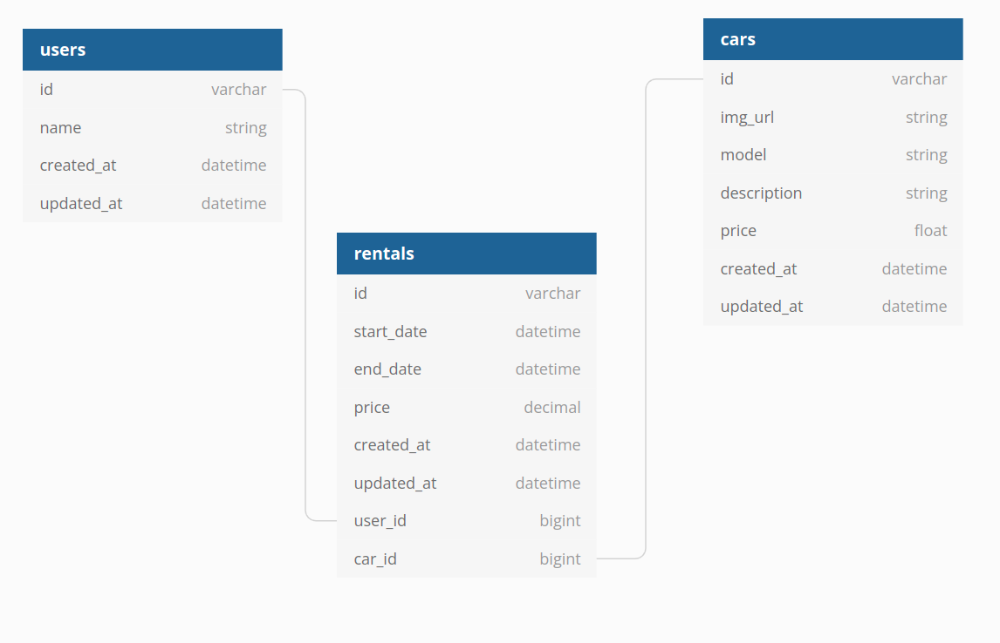

# FOR WHEELS API

> An API to serve a SPA built by the same team, for a luxury renting cars agency: For Wheels!

Rent one of a kind car, your dream car from **For Wheels**!!
This API provides information for the front-end SPA developed by us and. Accordingly to the user interaction, consumes it and renders the data on the UI.

## Built With

- Major languages: Ruby
- Frameworks: Ruby On Rails
- Technologies used: PostgreSQL 

## Live Demo

[Live Demo Link](https://for-wheels-api.herokuapp.com/cars)

## Kanban Board
Please find Kandban board [here](https://github.com/users/nicupop729/projects/3);

[Link to initial issue when Knaban Board was set](https://github.com/nicupop729/for_wheels_api/issues/20)

Number of team members for this project: 2;

## Getting Started

To get a local copy up and running follow these simple example steps.

### Prerequisites
In order to run this project on your system, please make sure that you have installed all of the followings:
 - IDE application
 - Ruby
 - Ruby on Rails
 - a web browser
### Setup

 - open your terminal and run the following command: `git clone https://github.com/nicupop729/for_wheels_api.git`;
 - Run the command `cd for_wheels`;
 - Run the command `bundle install`;
 - Run the command `rails db:create`;
 - Run the command `rails db:migrate`;
 - Run the command `rails s -p 8000`;

Once you completed this steps you should see the app running at: http://localhost:8000/ in your browser where you can explore different endpoints.

## Authors

👤 **Jonathas Tavares**

- GitHub: [jonathastavares](https://github.com/jonathastavares)
- LinkedIn: [Jonathas Tavares](https://www.linkedin.com/in/jonathas-tavares-24b8bba3/)

👤 **Nicolae Pop**

- GitHub: [@nicupop729](https://github.com/nicupop729)
- Twitter: [@nicupop729](https://twitter.com/nicupop729)
- LinkedIn: [LinkedIn](https://www.linkedin.com/in/nicolae-pop/)

## 🤝 Contributing

Contributions, issues, and feature requests are welcome!

Feel free to check the [issues page](../../issues/).

## Show your support

Give a ⭐️ if you like this project!

## Acknowledgments

- Thanks to [Microverse](https://www.microverse.org/) for the fabulous environment to learn web development.

## 📝 License

This project is [MIT](./MIT.md) licensed.
